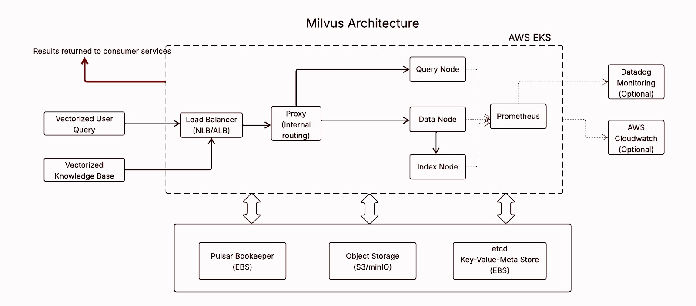

---

## 📐 High-Level Architecture

---

##  Components

###  Milvus Proxy: *Internal Routing Gateway*

###  Milvus Query Node
- Runtime engine for query execution — handles:
  - Similarity search
  - Filtering
  - Result aggregation  
- Needs RAM to load data segments from Object storage (e.g.S3/MinIO)
- Scaling tied to:
  - QPS
  - Index size

### Milvus Index Node
- Builds and manages vector indexes  
- Writes index files to object storage  
- Compute- and memory-intensive  
- Scales on demand (batch indexing)  
- Stores output on Object storage (e.g.S3/MinIO)

### Milvus Data Node
- Ingests, stores, and flushes vector + scalar data  
- Stores flushed segments in Object storage (e.g.S3/MinIO)

### Prometheus
- Scrapes metrics: CPU, memory, query durations, flush latency  
- Can integrate with **Datadog**

### Pulsar BookKeeper
- Write-ahead, replicated, persistent log store for Pulsar  
- Ensures fault tolerance  
- Requires **Block storage** for disk persistence

### S3/MinIO Object Storage
- Stores vectorized data and index files  

### Etcd
- Metadata store  
- Tracks state, coordinates tasks  
- Requires **Block storage** with regular backups

### Vectorizer Service
- Vectorized knowledge base that is persisted on the datanode
- Vectorization/Embedding of User query (real-time or batch)
